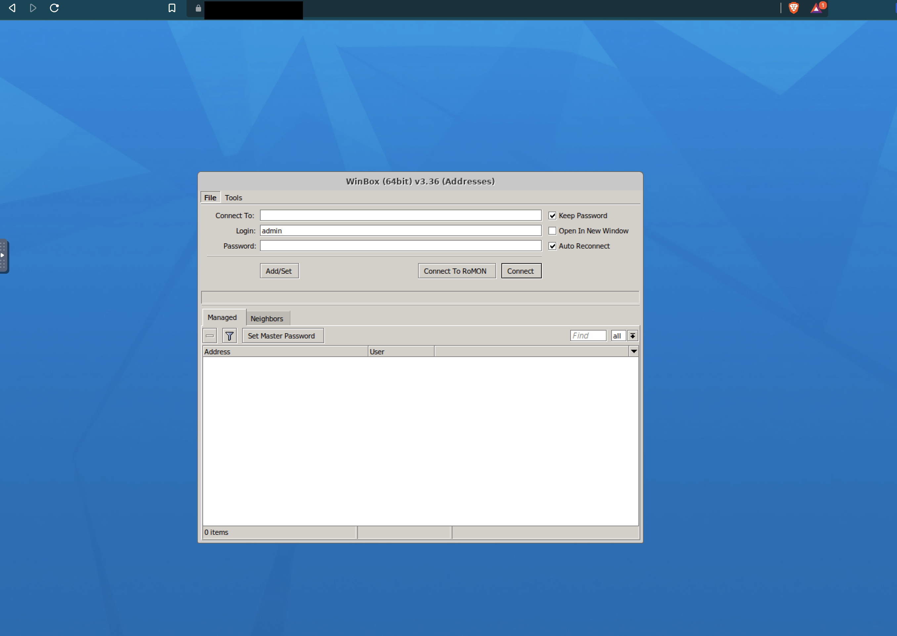
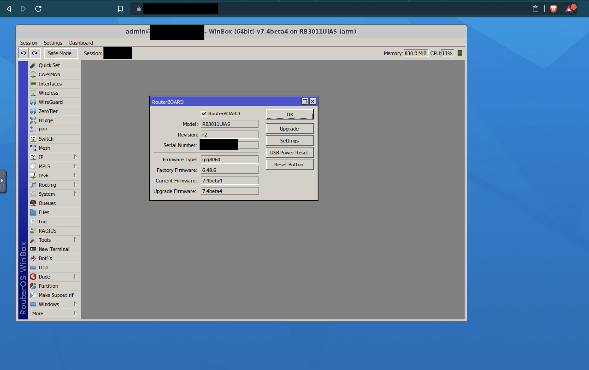

# Winbox in docker

 [](https://github.com/obeone/winbox-docker/actions/workflows/build-push-image.yaml)

 [](https://artifacthub.io/packages/search?repo=obeone)

Use Mikrotik's Winbox with your browser !

Using [KasmVNC](https://github.com/kasmtech/KasmVNC), this docker starts Winbox with Wine and make it avaiable in any browser.

## Screenshots




## Usage
### Docker
```sh
docker run -d --shm-size=512m -p 6901:6901 -e VNC_PW=password -v winbox_wine:/home/kasm-user/.wine ghcr.io/obeone/winbox:latest
```

You can access it at the address https://localhost:6901 with user `kasm_user` and password `password`.

It's not mandatory to mount (or bind) the volume, but it save initial configuration of Wine (which can take a while) and your winbox sessions.

#### TLS
If you want to use your own certificate rather than the autogenerated one, you can mount a PEM to the path `/config/private-cert.pem` :

```sh
docker run -d --shm-size=512m -p 6901:6901 -e VNC_PW=password -v winbox_wine:/home/kasm-user/.wine -v LOCAL_PEM_PATH:/config/private-cert.pem:ro ghcr.io/obeone/winbox:latest
```

### Kubernetes (Helm)
A helm chart exists, just follow
[documentation](https://github.com/obeone/charts)
